# 🌱 KrishiMitra

### AI-powered Explainable Smart Irrigation Assistant

KrishiMitra is an end-to-end AI + IoT smart irrigation system that combines real-time sensor monitoring, weather-aware rule-based decision making, machine learning forecasting, Retrieval-Augmented Generation (RAG), and Llama 3.1 to provide reliable, explainable irrigation recommendations for farmers.


---
## 🌾 Problem Statement

Agriculture relies heavily on timely irrigation, but many farmers still depend on fixed watering schedules or manual inspection of soil conditions. These approaches often lead to over-irrigation, under-irrigation, unnecessary water consumption, and delayed responses to changing weather conditions.

While modern IoT-based irrigation systems automate watering using soil moisture thresholds, they often lack contextual decision-making and fail to explain why a recommendation was made. Farmers are left with recommendations but little insight into the reasoning behind them.
---

## 💡 Our Solution

KrishiMitra is an AI-powered explainable smart irrigation assistant that combines real-time IoT sensing, weather-aware rule-based decision making, machine learning forecasting, Retrieval-Augmented Generation (RAG), and Large Language Models (LLMs) to deliver reliable irrigation recommendations.

Rather than simply telling farmers whether to irrigate, KrishiMitra explains the reasoning behind every recommendation using live sensor readings, weather forecasts, and crop-specific knowledge, making irrigation decisions more transparent and easier to trust.
---

## ✨ Key Contributions

- 🌱 Real-time monitoring using ESP32-based soil moisture, temperature, and humidity sensing.
- ☁️ Weather-aware irrigation recommendations using OpenWeather forecasts.
- 📏 Crop-specific irrigation thresholds for nine supported crops.
- 🤖 Machine learning model that predicts approximately when soil moisture will reach crop-specific irrigation thresholds.
- 🧠 Deterministic backend rule engine for safe and consistent irrigation decisions.
- 📚 Retrieval-Augmented Generation (RAG) for crop-specific question answering.
- 💬 Explainable AI responses powered by Llama 3.1 through the Groq API.
- 📱 Cross-platform mobile application built using React and Capacitor.
---

## 🌍 Overview

KrishiMitra is a full-stack AI + IoT smart irrigation platform designed to help farmers make informed irrigation decisions using real-time sensor data, weather forecasts, machine learning, and explainable artificial intelligence.

The system continuously collects soil moisture, temperature, and humidity data from an ESP32-based sensing unit and synchronizes it with Firebase Realtime Database. A FastAPI backend enriches this live data with weather forecasts from OpenWeather, predicts future irrigation needs using a machine learning model, determines irrigation recommendations through a deterministic rule engine, retrieves crop-specific knowledge using Retrieval-Augmented Generation (RAG), and finally generates a natural-language explanation using Llama 3.1 via the Groq API.

The React + Capacitor mobile application provides farmers with live monitoring, crop-specific recommendations, historical trends, and an AI assistant capable of explaining irrigation decisions in simple language.
---

# 🏗️ System Architecture

KrishiMitra follows a modular AI + IoT architecture where each component has a single, well-defined responsibility. Real-time sensor readings collected by the ESP32 are synchronized to Firebase, allowing both the mobile application and the FastAPI backend to access the latest field data.

The backend enriches these live readings with weather forecasts from OpenWeather, predicts future soil moisture behaviour using a machine learning model, determines irrigation recommendations through a deterministic rule engine, retrieves crop-specific knowledge using Retrieval-Augmented Generation (RAG), and finally generates an explainable natural-language response using Llama 3.1 via the Groq API.

This modular architecture separates **data collection**, **prediction**, **decision making**, **knowledge retrieval**, and **language generation**, making the system reliable, explainable, and easy to extend.

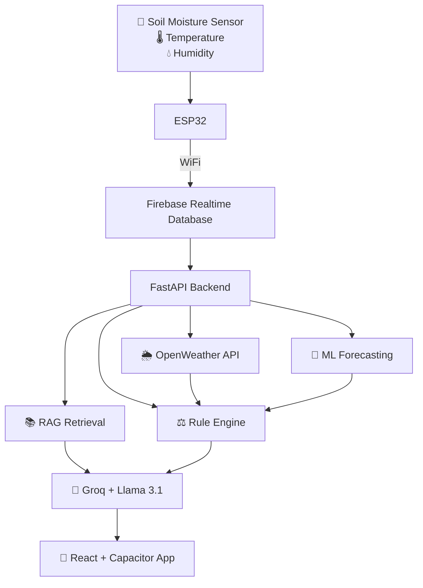

## 🧠 AI Decision Pipeline

Every irrigation recommendation passes through the following pipeline before being presented to the farmer.

| Step | Component | Responsibility |
|------|-----------|----------------|
| 📡 1 | **ESP32 + Firebase** | Collect and synchronize real-time soil moisture, temperature, humidity, crop type, and pump status. |
| 🌦️ 2 | **OpenWeather API** | Fetch current weather conditions and forecast rain probability for the selected location. |
| 🤖 3 | **Machine Learning Model** | Predict approximately how many future readings remain before soil moisture reaches the crop-specific irrigation threshold. |
| ⚖️ 4 | **Rule Engine** | Determine whether irrigation is required using crop thresholds, current moisture, rainfall status, and forecast rain probability. |
| 📚 5 | **RAG Retrieval** | Retrieve the most relevant crop-specific knowledge from the knowledge base using TF-IDF and cosine similarity. |
| 💬 6 | **Groq + Llama 3.1** | Generate a natural-language explanation for the backend recommendation using the retrieved knowledge and live sensor data. |
| 📱 7 | **Mobile Application** | Display the recommendation, explanation, live sensor values, and historical information to the farmer. |

> **Important:** The LLM **does not decide** whether irrigation should occur. The recommendation is computed entirely by the backend rule engine. The LLM's responsibility is only to explain that decision in clear, natural language.

---

## ⚙️ Tech Stack

| Category | Technologies |
|----------|--------------|
| **Frontend** | React, TypeScript, Vite, Capacitor |
| **Backend** | FastAPI, Python |
| **Database** | Firebase Realtime Database, Firebase Authentication |
| **Hardware** | ESP32, Soil Moisture Sensor |
| **Machine Learning** | Scikit-learn (Linear Regression, Ridge Regression, StandardScaler) |
| **AI & NLP** | Groq API, Llama 3.1, Retrieval-Augmented Generation (RAG) |
| **Information Retrieval** | TF-IDF, Cosine Similarity |
| **Weather Integration** | OpenWeather API |
| **UI** | Tailwind CSS, shadcn/ui, Lucide React |
| **Routing & State** | React Router DOM, Custom React Hooks |

> **Architecture:** IoT → Cloud → Machine Learning → Rule Engine → RAG → LLM → Mobile Application

---

# 🚀 Core Features

| Feature | Description |
|---------|-------------|
| 🌱 **Real-Time Sensor Monitoring** | Continuously monitors soil moisture, temperature, and humidity using an ESP32 and synchronizes live readings with Firebase Realtime Database. |
| ☁️ **Weather-Aware Irrigation** | Integrates OpenWeather API to incorporate current weather conditions and forecast rain probability into irrigation decisions. |
| 🤖 **Machine Learning Forecasting** | Predicts approximately how many future sensor readings remain before soil moisture reaches the crop-specific irrigation threshold using a trained Linear Regression model. |
| ⚖️ **Deterministic Rule Engine** | Makes reliable irrigation decisions using crop thresholds, current soil moisture, rainfall status, and forecast rain probability. |
| 📚 **Retrieval-Augmented Generation (RAG)** | Retrieves crop-specific information using TF-IDF and cosine similarity to provide grounded responses. |
| 💬 **Explainable AI Assistant** | Uses Groq-hosted Llama 3.1 to explain irrigation recommendations in simple, natural language without overriding backend decisions. |
| 📱 **Cross-Platform Mobile Application** | Built using React, TypeScript, and Capacitor to provide live monitoring, AI assistance, historical trends, and irrigation recommendations. |
| 🔔 **Smart Notifications & Pump Monitoring** | Displays pump status, irrigation alerts, and important updates to help farmers monitor field conditions efficiently. |

---

# 📂 Repository Structure

```text
krishimitra/
│
├── 📱 src/                     # React + TypeScript frontend
│   ├── pages/                  # Dashboard, History, Actions, Settings
│   ├── components/             # Reusable UI components
│   ├── hooks/                  # Firebase, GPS, Language hooks
│   ├── lib/                    # Firebase config, crop data, utilities
│   └── assets/                 # Images, icons, static resources
│
├── ⚙️ backend/                 # FastAPI backend
│   ├── API endpoints
│   ├── Rule-based irrigation engine
│   ├── RAG pipeline
│   ├── LLM integration (Groq + Llama 3.1)
│   ├── Weather service
│   └── ML prediction API
│
├── 🤖 ml-model/                # Model training and evaluation
│   ├── Data preprocessing
│   ├── EDA
│   ├── Model training
│   ├── Cross-validation
│   ├── Saved models (.pkl)
│   └── Evaluation plots
│
├── 🌱 firmware/                # ESP32 Arduino firmware
│
├── 📱 android/                 # Capacitor Android project
│
├── 📂 public/                  # Static assets & screenshots
│
├── README.md
└── package.json
```
---
# 🚀 Getting Started

## Prerequisites

Before running the project, ensure the following are installed:

- Node.js 18+
- Python 3.10+
- Android Studio (optional, for APK generation)
- Arduino IDE (for ESP32 firmware)
- Firebase project with Realtime Database enabled
- OpenWeather API key
- Groq API key (Llama 3.1 inference)

---

## 1️⃣ Clone the Repository

```bash
git clone https://github.com/palakchiraniya03/krishimitra.git
cd krishimitra
```

---

## 2️⃣ Install Dependencies

### Frontend

```bash
npm install
```

### Backend

```bash
cd backend
pip install -r requirements.txt
```

---

## 3️⃣ Configure Environment Variables

Create a `.env` file inside the backend directory.

```env
GROQ_API_KEY=your_groq_api_key
OPENWEATHER_API_KEY=your_openweather_api_key
```

Configure your Firebase project credentials inside:

```text
src/lib/firebase.ts
```

and update the ESP32 Firebase configuration inside:

```text
firmware/main.ino
```

---

## 4️⃣ Start the Backend

```bash
cd backend
uvicorn main:app --reload
```

The FastAPI backend will be available at:

```
http://127.0.0.1:8000
```

---

## 5️⃣ Start the Frontend

```bash
npm run dev
```

The React application will be available at:

```
http://localhost:5173
```

---

## 6️⃣ Build the Android Application

```bash
npm run build
npx cap sync android
npx cap open android
```

Build the APK using Android Studio.

---

## 7️⃣ Flash the ESP32 Firmware

1. Open the `firmware/` folder in Arduino IDE.
2. Update your Wi-Fi credentials.
3. Configure Firebase credentials.
4. Upload the firmware to the ESP32.
5. The device will automatically begin sending live sensor data to Firebase.

---

## 🌐 Live Demo

🔗 **Live Application:** https://krishimitra-mocha.vercel.app

Experience KrishiMitra in action through the deployed web application. The demo showcases real-time sensor monitoring, weather-aware irrigation recommendations, machine learning forecasting, crop-specific insights, and the AI-powered explainable irrigation assistant.

---

# 🗄️ Firebase Realtime Database Schema

```text
/
├── plant
│   ├── moisture: 42
│   ├── temperature: 28.4
│   ├── humidity: 63
│   ├── threshold: 50
│   ├── pump: "OFF"
│   ├── type: "wheat"
│   └── place: "Pune, Maharashtra"
│
└── history
    ├── 1716800000000
    │   ├── moisture: 38
    │   ├── temperature: 28.1
    │   ├── humidity: 61
    │   └── timestamp: 1716800000000
    │
    └── ...
```

The `plant` node stores the latest live sensor readings used by the irrigation engine, while the `history` node maintains historical readings for visualization and machine learning model training.

---
## 📸 Screenshots

### App Interface
| Dashboard | Actions | Crop Select |
|---|---|---|
| 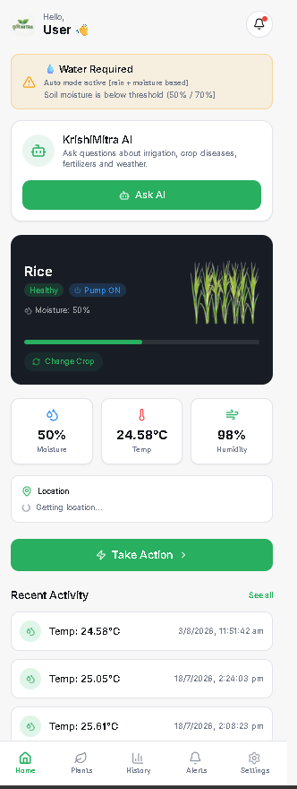 | 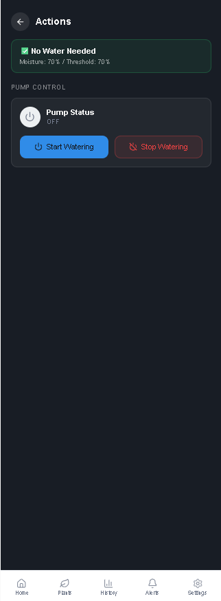 | 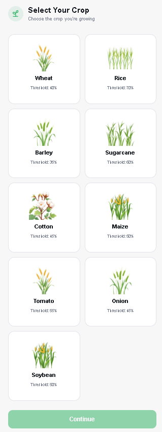 |

| History | Settings |
|---|---|
| 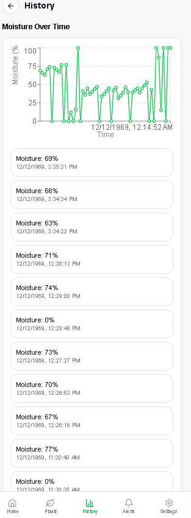 |  |

### Multilingual Support
| Dashboard (Hindi) | Crop Select (Marathi) |
|---|---|
| 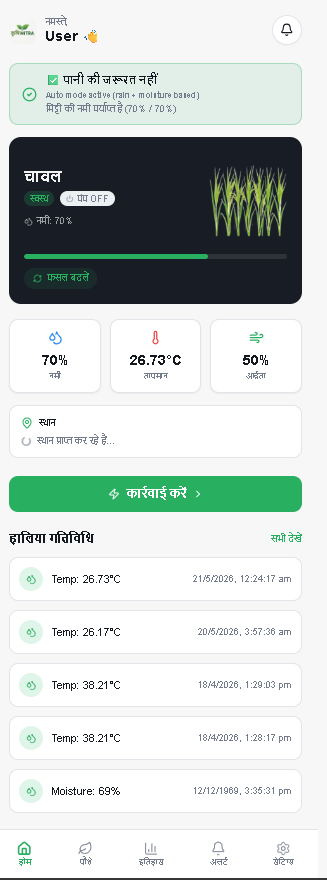 | 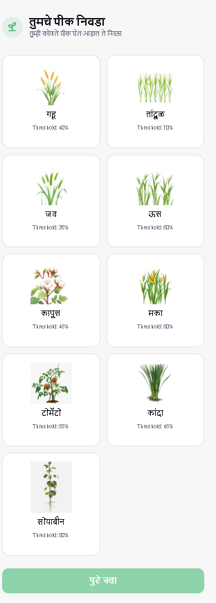 |

### Hardware Setup
| ESP32 + Soil Moisture Sensor |
|---|
| 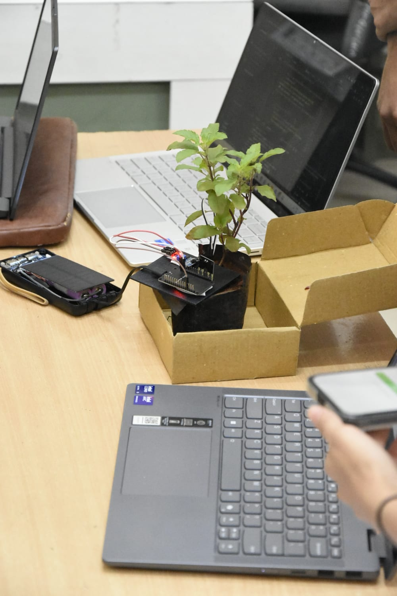 |
---

## 🌾 Supported Crops

| Crop | Default Moisture Threshold |
|---|---|
| 🌾 Wheat | 40% |
| 🌾 Rice | 70% |
| 🌾 Barley | 35% |
| 🎋 Sugarcane | 60% |
| 🌿 Cotton | 45% |
| 🌽 Maize | 50% |
| 🍅 Tomato | 55% |
| 🧅 Onion | 45% |
| 🌱 Soybean | 50% |
---

# 🧠 Predictive Irrigation Model

## Objective

The predictive irrigation model estimates **how many future sensor readings remain before soil moisture reaches a crop-specific irrigation threshold**. Rather than predicting the next moisture value, the model forecasts when irrigation is likely to become necessary using historical data collected from the deployed ESP32 system.

---

## Dataset & Preprocessing

- **56** real soil moisture readings were exported from Firebase history.
- **11 readings** with exactly **0% moisture** were identified as probable sensor-disconnect errors and removed.
- The final dataset contained **45 cleaned readings**.
- Since earlier firmware versions logged unreliable timestamps, the chronological order of readings was used as a proxy for time.

---

## Exploratory Data Analysis (EDA)

The cleaned dataset showed:

- Moisture Range: **12% – 100%**
- Mean: **53.7%**
- Median: **45%**
- Standard Deviation: **23.1**

EDA confirmed that the cleaning process removed obvious sensor errors while preserving genuine moisture variation.

---

## Feature Engineering

A sliding-window transformation was applied to convert the moisture time series into supervised learning examples.

Each training example consisted of two features:

- **Last Moisture Value** – the most recent sensor reading.
- **Recent Trend** – the change in moisture across the observation window.

All features were standardized using **StandardScaler** before model training to ensure feature coefficients were directly comparable.

---

## Model Selection

Two regression models were evaluated:

- Linear Regression
- Ridge Regression

Both models achieved identical performance (**MAE = 0.84**), indicating that regularization provided no measurable improvement for the current dataset. Linear Regression was therefore selected due to its simplicity and interpretability.

---

## Model Validation

Traditional random k-fold cross-validation is unsuitable for overlapping time-series windows because it can introduce **data leakage**.

To preserve temporal ordering, **TimeSeriesSplit** was used, ensuring that:

- Training always uses earlier observations.
- Testing always uses later observations.
- Overlapping windows never leak future information into training.

---

## Feature Importance

Using standardized coefficients (Wheat dataset):

| Feature | Importance |
|---------|-----------:|
| Last Moisture Value | **0.659** |
| Recent Trend | **-0.441** |

The model relies more heavily on the current moisture level than on the recent rate of moisture change.

---

## Evaluation Results

Cross-validated Mean Absolute Error (MAE):

| Crop | MAE | Training Examples |
|------|----:|------------------:|
| Sugarcane (60%) | **0.09** | 30 |
| Tomato (55%) | **0.09** | 30 |
| Maize (50%) | **0.13** | 30 |
| Soybean (50%) | **0.13** | 30 |
| Rice (70%) | **0.38** | 40 |
| Cotton (45%) | **0.52** | 30 |
| Onion (45%) | **0.52** | 30 |
| Wheat (40%) | **1.14** | 30 |
| Barley (35%) | **3.15** | 30 |

---

## Model Diagnostics

Additional evaluation was performed to understand model behaviour beyond MAE.

- **Residual Analysis** showed a mean residual of **-0.168** with a residual standard deviation of **1.028**, indicating predictions were approximately unbiased despite limited precision.
- **Window Size Sensitivity** compared sliding-window sizes of **3**, **5**, and **7**, with a window size of **5** achieving the best validation performance.
- **Actual vs Predicted** and **Residual** plots were generated to visually assess prediction quality.

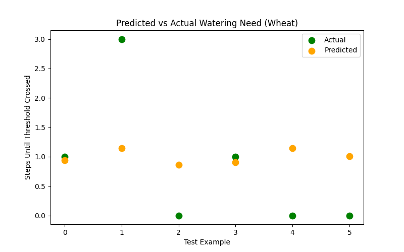
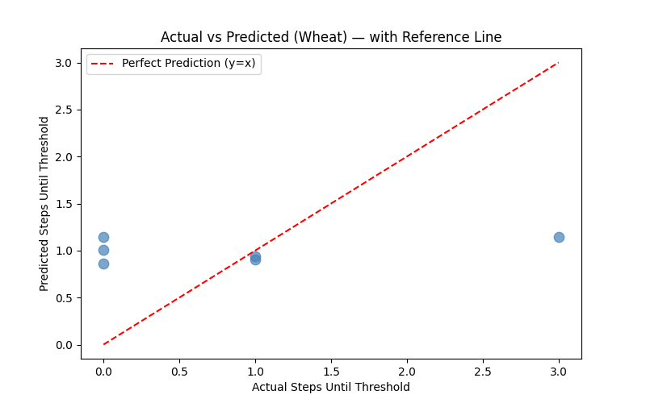
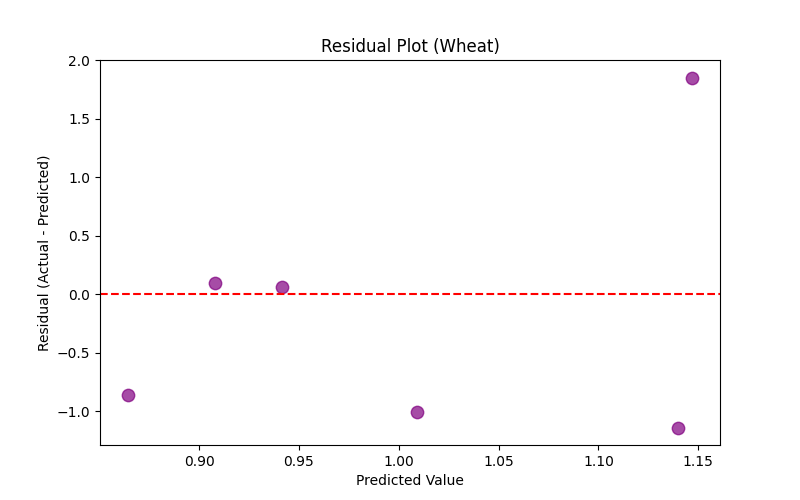
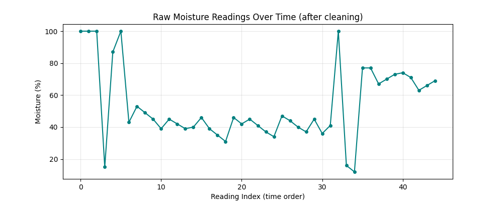
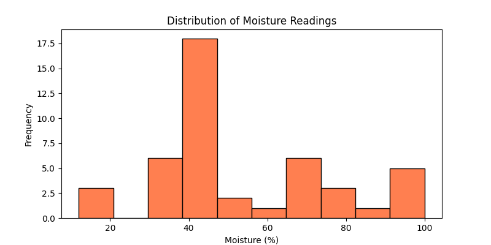

---

## Key Findings

- Current moisture contributes more strongly to predictions than recent moisture trend.
- Higher-threshold crops generally produced lower prediction errors because they require shorter forecasting horizons.
- Linear Regression provided performance comparable to Ridge Regression while remaining simpler and easier to interpret.

---

## Limitations

- The dataset is relatively small (**24–40 examples per crop** after cleaning).
- Some extremely low MAE values are likely influenced by limited dataset diversity rather than strong generalization.
- The current model is trained offline using exported Firebase history and therefore does not continuously learn from incoming sensor data.

---

## Future Improvements

- Replace offline batch training with **online/incremental learning** using streaming sensor data.
- Expand the dataset through longer field deployments.
- Incorporate additional environmental variables such as **temperature**, **humidity**, and **weather conditions**.
- Explore more advanced forecasting models once larger datasets become available.

---

## ⚠️ Known Limitations & Future Work

### Current Limitations

- The predictive irrigation model is trained on a relatively small real-world dataset collected from the deployed ESP32 system. Prediction accuracy is expected to improve as more sensor history becomes available.
- The current machine learning pipeline performs offline batch training using exported Firebase history rather than continuous online learning.
- The Retrieval-Augmented Generation (RAG) module currently uses TF-IDF and cosine similarity for document retrieval. Semantic embedding-based retrieval is planned to improve answer quality for larger knowledge bases.
- The current prediction model uses historical soil moisture trends only. Future versions will incorporate additional environmental variables such as temperature, humidity, rainfall, and weather forecasts.

### Future Improvements

- Increase the amount of real sensor data collected through long-term field deployment.
- Replace TF-IDF retrieval with embedding-based semantic search.
- Support incremental (online) model updates without requiring manual retraining.
- Evaluate more advanced forecasting models after collecting a larger dataset.
- Expand support for additional crops, sensors, and regional irrigation practices.
---

## 👥 Contributors

| Contributor | Responsibilities |
|-------------|------------------|
| **Palak Chiraniya** | FastAPI Backend, Machine Learning Pipeline, Retrieval-Augmented Generation (RAG), LLM Integration, Documentation |
| **Divyam Jain** | ESP32 firmware, IoT hardware integration |
| **Aryan Shahi** | Hardware integration and testing |
| **Diya Toshniwal** | UI support and project collaboration |

## 🏆 Achievements

- Developed during the **IEEE Techfiesta Hackathon at PICT Pune**.
- Selected as an **IoT Domain Finalist** at the **Resonance Hackathon, VIT**.

---
